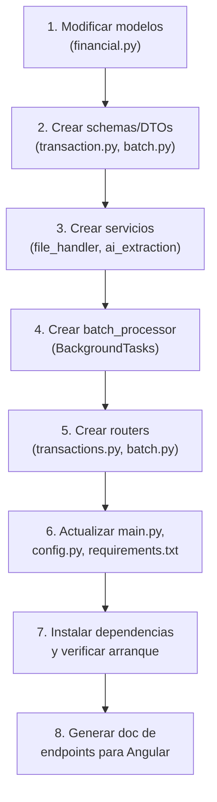

# Implementación de Módulos 1 y 2 — Canal de Entrada Híbrido + Bulk Processing

## Contexto

El microservicio **PersonalFinances** tiene su base inicializada (modelos, seguridad JWT, config, `main.py`). Ahora se necesita implementar los dos primeros módulos funcionales core:

1. **Módulo A — Canal de Entrada Híbrido (Manual / IA)**: Registro manual de transacciones y Smart Ingestion mediante modelos de visión IA.
2. **Módulo B — Procesamiento por Lotes (Bulk Processing)**: Carga masiva de hasta 10 archivos con procesamiento asíncrono.

Ambos módulos comparten la infraestructura de procesamiento IA y se complementan funcionalmente (el bulk llama al mismo servicio de ingestion que el individual).

---

## User Review Required

> [!IMPORTANT]
> **Proveedor de IA**: El plan soporta **OpenAI** (vía API key) y **Ollama** (modelo local). Se implementará un servicio abstracto con ambos proveedores. Confirma cuál prefieres como default, o si deseas que ambos sean seleccionables por variable de entorno.

> [!WARNING]
> **Dependencias nuevas**: Se agregarán `openai`, `python-multipart`, `aiofiles` y `Pillow` al `requirements.txt`. `python-multipart` es obligatorio para que FastAPI procese `UploadFile`. Si usas Ollama, también se requerirá `httpx` (para llamadas HTTP al servidor local de Ollama).

> [!IMPORTANT]  
> **Campo `description` en Transaction**: El modelo actual de `Transaction` no tiene un campo de descripción/nota textual. Se propone agregar `description: Optional[str]` para almacenar el texto extraído por la IA (nombre del comercio, concepto, etc.) y facilitar la futura conciliación bancaria (Módulo C). Confirma si estás de acuerdo.

---

## Open Questions

> [!IMPORTANT]
> 1. **Almacenamiento de archivos**: ¿Los archivos subidos (imágenes/PDFs) se guardan en disco local (`uploads/` en el proyecto) o prefieres un servicio externo (S3, Azure Blob)? El plan asume **disco local** en `data/uploads/{tenant_id}/`.
> 2. **Modelo de visión OpenAI**: ¿Usarás `gpt-4o` o `gpt-4o-mini` para la extracción? `gpt-4o-mini` es significativamente más barato pero menos preciso con recibos complejos.
> 3. **Categorías predefinidas**: ¿Quieres que la IA sugiera categorías libres o que las restrinja a las categorías existentes en BD para ese tenant? El plan propone enviar la lista de categorías del tenant al prompt de la IA para que sugiera una de las existentes.
> 4. **Límite de tamaño de archivo**: ¿Cuál es el tamaño máximo por archivo? El plan propone **10 MB por archivo**.

---

## Proposed Changes

### 1. Ajustes a Modelos Existentes

#### [MODIFY] [financial.py](file:///c:/Users/haroldaaguilarb/source/repos/Api-finanzas-personales/app/models/financial.py)

Cambios necesarios en los modelos SQLModel:

- **`Transaction`**: Agregar campos:
  - `description: Optional[str]` — Nota textual / concepto extraído por IA.
  - `source: str = "manual"` — Origen del registro (`manual` | `smart_ingestion` | `bulk`).
  - `original_file_path: Optional[str]` — Ruta al archivo fuente (si aplica).
  - `batch_id: Optional[int]` — FK a `BatchIngestion` (para vincular transacciones de lotes).
  - Relación `batch: Optional[BatchIngestion]`.

- **`BatchIngestion`**: Agregar campos:
  - `total_processed: int = 0` — Archivos procesados exitosamente.
  - `total_failed: int = 0` — Archivos que fallaron.
  - `completed_at: Optional[datetime]` — Timestamp de finalización.
  - Relación `transactions: List[Transaction]` para consultar las transacciones del lote.

- **`Category`**: Agregar campo `description: Optional[str]` para contexto semántico en el prompt de IA.

---

### 2. Schemas / DTOs (Pydantic)

#### [NEW] `app/schemas/__init__.py`
Inicialización del paquete de schemas.

#### [NEW] `app/schemas/transaction.py`
DTOs de request/response para transacciones:

```python
# --- Requests ---
class TransactionCreate(BaseModel):
    """Registro manual de transacción."""
    amount: float
    date: datetime
    merchant: str
    description: Optional[str]
    account_id: int
    category_id: Optional[int]

# --- Responses ---
class TransactionResponse(BaseModel):
    """DTO de respuesta (nunca exponer la entidad directa)."""
    id: int
    amount: float
    date: datetime
    merchant: str
    description: Optional[str]
    status: str        # "Confirmed" | "PendingReview"
    source: str        # "manual" | "smart_ingestion" | "bulk"
    account_id: int
    category_id: Optional[int]
    category_name: Optional[str]
    batch_id: Optional[int]
    is_active: bool

class SmartIngestionResponse(BaseModel):
    """Resultado de la extracción IA de un solo archivo."""
    transaction: TransactionResponse
    ai_confidence: float          # 0.0 - 1.0
    raw_extraction: dict          # JSON crudo devuelto por la IA
    message: str
```

#### [NEW] `app/schemas/batch.py`
DTOs para procesamiento por lotes:

```python
class BatchCreateResponse(BaseModel):
    """Respuesta inmediata al crear un lote (antes del procesamiento)."""
    batch_id: int
    file_count: int
    status: str             # "Processing"
    message: str

class BatchStatusResponse(BaseModel):
    """Estado actual de un lote en procesamiento."""
    batch_id: int
    status: str             # "Processing" | "Completed" | "PartiallyCompleted" | "Failed"
    file_count: int
    total_processed: int
    total_failed: int
    created_at: datetime
    completed_at: Optional[datetime]
    transactions: List[TransactionResponse]
```

---

### 3. Servicio de IA (Extracción de Datos)

#### [NEW] `app/services/__init__.py`
Inicialización del paquete de servicios.

#### [NEW] `app/services/ai_extraction.py`
Servicio centralizado que encapsula la lógica de extracción por IA. Ambos módulos (individual y bulk) lo invocan.

**Responsabilidades:**
1. Recibir el archivo (imagen o PDF) como bytes.
2. Convertir a base64 si es imagen; extraer texto si es PDF.
3. Construir el prompt estructurado con las categorías disponibles del tenant.
4. Llamar al modelo de visión (OpenAI `gpt-4o` o Ollama local).
5. Parsear la respuesta JSON estructurada: `{ amount, date, merchant, suggested_category, confidence }`.
6. Retornar un dataclass `ExtractionResult` con los datos parseados.

**Prompt de extracción (Structured Output):**
```
Analiza esta imagen/documento financiero y extrae los siguientes datos en formato JSON:
{
  "amount": <float>,
  "date": "<YYYY-MM-DD>",
  "merchant": "<nombre del comercio>",
  "description": "<descripción/concepto>",
  "suggested_category": "<una de: [lista de categorías del tenant]>",
  "confidence": <float 0-1>
}
Si no puedes extraer un campo, usa null. No inventes datos.
```

#### [NEW] `app/services/file_handler.py`
Utilidad para:
- Validar tipo MIME (solo `image/jpeg`, `image/png`, `application/pdf`).
- Validar tamaño máximo (10 MB).
- Guardar el archivo en disco: `data/uploads/{tenant_id}/{uuid}.{ext}`.
- Retornar la ruta relativa guardada.

---

### 4. Routers / Endpoints

#### [NEW] `app/api/__init__.py`
Inicialización del paquete API.

#### [NEW] `app/api/transactions.py`
Router de transacciones — Canal de Entrada Híbrido.

| Método | Ruta | Descripción |
|---|---|---|
| `POST` | `/api/transactions` | Registro **manual** de transacción → estado `Confirmed` |
| `POST` | `/api/transactions/smart-ingest` | Smart Ingestion: sube 1 archivo → IA extrae → estado `PendingReview` |
| `GET` | `/api/transactions` | Listar transacciones del tenant (con filtros por status, fecha, cuenta) |
| `GET` | `/api/transactions/{id}` | Obtener transacción por ID |
| `PATCH` | `/api/transactions/{id}/confirm` | Confirmar transacción `PendingReview` → `Confirmed` |
| `PATCH` | `/api/transactions/{id}` | Editar transacción (campos editables antes o después de confirmar) |
| `DELETE` | `/api/transactions/{id}` | **Soft delete** (`is_active = False`) |

#### [NEW] `app/api/batch.py`
Router de procesamiento por lotes.

| Método | Ruta | Descripción |
|---|---|---|
| `POST` | `/api/batch/ingest` | Carga masiva de hasta 10 archivos → retorna `batch_id` inmediato |
| `GET` | `/api/batch/{batch_id}` | Consultar estado del lote y sus transacciones extraídas |
| `GET` | `/api/batch` | Listar todos los lotes del tenant |
| `PATCH` | `/api/batch/{batch_id}/confirm-all` | Confirmar todas las transacciones `PendingReview` del lote |

---

### 5. Procesamiento Asíncrono (BackgroundTasks)

#### [NEW] `app/services/batch_processor.py`
Lógica del procesamiento en segundo plano invocada por `BackgroundTasks` de FastAPI:

```python
def process_batch(batch_id: int, files_data: List[bytes], filenames: List[str], tenant_id: str):
    """
    Se ejecuta en background. Para cada archivo:
    1. Guardar en disco.
    2. Llamar a ai_extraction.extract().
    3. Crear Transaction con status='PendingReview', source='bulk', batch_id.
    4. Actualizar BatchIngestion.total_processed / total_failed.
    5. Al terminar, actualizar BatchIngestion.status y completed_at.
    """
```

> [!NOTE]
> Se usa `BackgroundTasks` de FastAPI (no Celery) según las especificaciones del prompt. El procesamiento es secuencial dentro del background thread. Para un volumen mayor a 10 archivos en el futuro, se podría migrar a una cola de tareas.

---

### 6. Ajustes a Archivos Existentes

#### [MODIFY] [config.py](file:///c:/Users/haroldaaguilarb/source/repos/Api-finanzas-personales/app/core/config.py)
Agregar configuraciones de IA:
```python
# AI Settings
OPENAI_API_KEY: str = ""
OPENAI_MODEL: str = "gpt-4o-mini"
AI_PROVIDER: str = "openai"       # "openai" | "ollama"
OLLAMA_BASE_URL: str = "http://localhost:11434"
OLLAMA_MODEL: str = "llava"

# File Upload Settings
MAX_FILE_SIZE_MB: int = 10
UPLOAD_DIR: str = "data/uploads"
```

#### [MODIFY] [main.py](file:///c:/Users/haroldaaguilarb/source/repos/Api-finanzas-personales/app/main.py)
- Importar e incluir los nuevos routers:
```python
from app.api.transactions import router as transactions_router
from app.api.batch import router as batch_router

app.include_router(transactions_router)
app.include_router(batch_router)
```

#### [MODIFY] [requirements.txt](file:///c:/Users/haroldaaguilarb/source/repos/Api-finanzas-personales/requirements.txt)
Agregar dependencias:
```
openai>=1.30.0
python-multipart>=0.0.6
aiofiles>=23.0.0
Pillow>=10.0.0
httpx>=0.27.0
```

#### [MODIFY] [models/__init__.py](file:///c:/Users/haroldaaguilarb/source/repos/Api-finanzas-personales/app/models/__init__.py)
Actualizar exports si se agregan campos/relaciones.

---

### 7. Documento de Endpoints para Frontend

#### [NEW] `docs/API_ENDPOINTS_MODULOS_1_2.md`
Archivo markdown con la referencia completa de endpoints, payloads, responses y flujos para el equipo de Angular. Se genera como entregable final.

---

## Resumen de Archivos

| Acción | Archivo | Descripción |
|---|---|---|
| MODIFY | `app/models/financial.py` | Nuevos campos en `Transaction` y `BatchIngestion` |
| MODIFY | `app/core/config.py` | Settings de IA y uploads |
| MODIFY | `app/main.py` | Registrar routers |
| MODIFY | `requirements.txt` | Nuevas dependencias |
| NEW | `app/schemas/__init__.py` | Paquete de DTOs |
| NEW | `app/schemas/transaction.py` | DTOs de transacciones |
| NEW | `app/schemas/batch.py` | DTOs de lotes |
| NEW | `app/services/__init__.py` | Paquete de servicios |
| NEW | `app/services/ai_extraction.py` | Servicio de extracción IA |
| NEW | `app/services/file_handler.py` | Validación y guardado de archivos |
| NEW | `app/services/batch_processor.py` | Procesador asíncrono de lotes |
| NEW | `app/api/__init__.py` | Paquete de routers |
| NEW | `app/api/transactions.py` | Router de transacciones |
| NEW | `app/api/batch.py` | Router de lotes |
| NEW | `docs/API_ENDPOINTS_MODULOS_1_2.md` | Doc de endpoints para Angular |

---

## Orden de Ejecución



---

## Verification Plan

### Automated Tests
- `uvicorn app.main:app --reload` → Verificar que el servidor arranca sin errores de importación.
- `python -c "from app.models.financial import *; from app.schemas.transaction import *; from app.schemas.batch import *; print('OK')"` → Verificar imports.

### Manual Verification
1. **POST `/api/transactions`** con un JSON manual → debe crear transacción `Confirmed`.
2. **POST `/api/transactions/smart-ingest`** con una imagen de recibo → debe retornar extracción IA con estado `PendingReview`.
3. **POST `/api/batch/ingest`** con 3 archivos → debe retornar `batch_id` inmediato, y el lote debe procesarse en background.
4. **GET `/api/batch/{id}`** → debe mostrar el estado del lote y las transacciones extraídas.
5. **PATCH `/api/transactions/{id}/confirm`** → debe cambiar estado a `Confirmed`.
6. Verificar que la BD SQLite contiene los registros con los campos correctos (`tenant_id`, `source`, `batch_id`, etc.).
7. Verificar que los archivos se guardan en `data/uploads/{tenant_id}/`.
