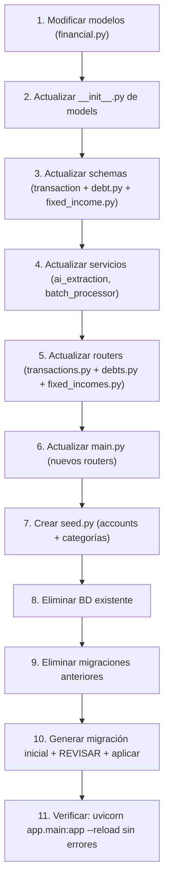

# INSTRUCCIÓN: Mejora de Modelos y Reglas de Negocio — PersonalFinances

> **IMPORTANTE:** Este documento es una especificación de cambios a implementar. El código actual en `app/models/financial.py`, `app/services/ai_extraction.py` y demás archivos mencionados **AÚN NO refleja estos cambios**. Un agente de IA debe ejecutar las modificaciones descritas aquí.

---

## 0. Resumen de Cambios Requeridos

| # | Cambio | Archivos impactados |
|---|---|---|
| 1 | `Account` y `Category` pasan de heredar `TenantBaseModel` a heredar `SQLModel` directamente (tablas globales, sin `tenant_id` ni `is_active`) | `app/models/financial.py`, `app/models/__init__.py`, `app/services/ai_extraction.py` |
| 2 | `Account`: agregar campo `type` (`bank`, `digital_wallet`, `cash`, `merchant`) | `app/models/financial.py` |
| 3 | `Transaction`: reemplazar `account_id`/`merchant` por `id_from_account`, `id_destination_account`, `name_from`, `name_destination`. `description` a requerido. Agregar columna `transaction_type` (`expense`, `income`, `transfer`). | `app/models/financial.py`, `app/schemas/transaction.py`, `app/api/transactions.py`, `app/services/ai_extraction.py`, `app/services/batch_processor.py` |
| 4 | Nueva tabla `Debt` (deudas/obligaciones con fechas de corte y pago) | `app/models/financial.py`, `app/schemas/debt.py`, `app/api/debts.py` |
| 5 | Nueva tabla `FixedIncome` + `FixedIncomePayment` (ingresos fijos configurables con confirmación de pago) | `app/models/financial.py`, `app/schemas/fixed_income.py`, `app/api/fixed_incomes.py` |
| 6 | Seed data de cuentas base colombianas + categorías genéricas | `app/db/seed.py` |
| 7 | Migración: eliminar BD existente y crear desde cero con la migración inicial | BD + migraciones |
| 8 | Config: agregar claves necesarias en `app/core/config.py` | `app/core/config.py` |

---

## 1. Reglas de Negocio

### 1.1 Account

`Account` es una tabla **global** (catálogo compartido entre todos los tenants). Representa bancos, billeteras digitales, efectivo, comercios, personas. Se usa como referencia FK desde `Transaction` para origen y destino.

### 1.2 Category

`Category` es una tabla **global** (catálogo compartido entre tenants). No necesita `tenant_id` ni `is_active`.

---

## 2. Cambios en Modelos (`app/models/financial.py`)

### 2.1 Account — Estado actual → Estado deseado

**Estado actual** (heredando de `TenantBaseModel`):
```python
class Account(TenantBaseModel, table=True):
    id: Optional[int] = Field(default=None, primary_key=True)
    name: str = Field(index=True)
    balance: float = Field(default=0.0)
    transactions: List["Transaction"] = Relationship(back_populates="account")
```

**Estado deseado** (hereda de `SQLModel`, tabla global):
```python
class Account(SQLModel, table=True):
    id: Optional[int] = Field(default=None, primary_key=True)
    name: str = Field(index=True)
    type: str = Field(default="bank", description="bank, digital_wallet, cash, merchant")
    balance: float = Field(default=0.0)

    transactions_from: List["Transaction"] = Relationship(
        back_populates="account_from",
        sa_relationship_kwargs={"foreign_keys": "Transaction.id_from_account"}
    )
    transactions_destination: List["Transaction"] = Relationship(
        back_populates="account_destination",
        sa_relationship_kwargs={"foreign_keys": "Transaction.id_destination_account"}
    )
```

> **Importante:** Cambiar `from sqlmodel import Field, Relationship` a `from sqlmodel import SQLModel, Field, Relationship` para poder usar `SQLModel` como base.

### 2.2 Category — Estado actual → Estado deseado

**Estado actual** (heredando de `TenantBaseModel`):
```python
class Category(TenantBaseModel, table=True):
    id: Optional[int] = Field(default=None, primary_key=True)
    name: str = Field(index=True)
    description: Optional[str] = Field(default=None, description="Category context for AI")
    transactions: List["Transaction"] = Relationship(back_populates="category")
```

**Estado deseado** (hereda de `SQLModel`, tabla global):
```python
class Category(SQLModel, table=True):
    id: Optional[int] = Field(default=None, primary_key=True)
    name: str = Field(index=True)
    description: Optional[str] = Field(default=None, description="Category context for AI")
    transactions: List["Transaction"] = Relationship(back_populates="category")
```

### 2.3 Transaction — Estado actual → Estado deseado

**Estado actual:**
```python
class Transaction(TenantBaseModel, table=True):
    id: Optional[int] = Field(default=None, primary_key=True)
    amount: float
    date: datetime
    merchant: str
    description: Optional[str] = Field(default=None)
    source: str = Field(default="manual")
    original_file_path: Optional[str] = Field(default=None)
    status: str = Field(default="Confirmed")
    batch_id: Optional[int] = Field(default=None, foreign_key="batchingestion.id", ondelete="SET NULL")
    batch: Optional[BatchIngestion] = Relationship(back_populates="transactions")
    account_id: int = Field(foreign_key="account.id", ondelete="RESTRICT")
    account: Account = Relationship(back_populates="transactions")
    category_id: Optional[int] = Field(default=None, foreign_key="category.id", ondelete="RESTRICT")
    category: Optional[Category] = Relationship(back_populates="transactions")
```

**Estado deseado:**
```python
class Transaction(TenantBaseModel, table=True):
    id: Optional[int] = Field(default=None, primary_key=True)
    amount: float
    date: datetime
    description: str                                          # REQUERIDO (campo principal)
    transaction_type: str = Field(default="expense")          # expense, income, transfer
    name_from: str                                            # Quién envía (texto)
    name_destination: str                                     # Quién recibe (texto)
    source: str = Field(default="manual")                     # manual, smart_ingestion, bulk
    original_file_path: Optional[str] = Field(default=None)
    status: str = Field(default="Confirmed")                  # PendingReview, Confirmed

    batch_id: Optional[int] = Field(default=None, foreign_key="batchingestion.id", ondelete="SET NULL")
    batch: Optional[BatchIngestion] = Relationship(back_populates="transactions")

    id_from_account: Optional[int] = Field(default=None, foreign_key="account.id", ondelete="RESTRICT")
    account_from: Optional["Account"] = Relationship(
        back_populates="transactions_from",
        sa_relationship_kwargs={"foreign_keys": "Transaction.id_from_account"}
    )

    id_destination_account: Optional[int] = Field(default=None, foreign_key="account.id", ondelete="RESTRICT")
    account_destination: Optional["Account"] = Relationship(
        back_populates="transactions_destination",
        sa_relationship_kwargs={"foreign_keys": "Transaction.id_destination_account"}
    )

    category_id: Optional[int] = Field(default=None, foreign_key="category.id", ondelete="RESTRICT")
    category: Optional["Category"] = Relationship(back_populates="transactions")
```

#### Regla de integridad sobre los campos de origen/destino

`name_from` y `name_destination` son **texto libre** (siempre visibles, no dependen de la FK). Las FKs (`id_from_account`, `id_destination_account`) son **referencias opcionales** para consultas y reports. Una transacción puede tener:
- Ambas FKs pobladas (origen y destino existen en Accounts)
- Solo una FK poblada (ej. un comercio no registrado aún como Account)
- Ninguna FK poblada (solo texto libre)

### 2.4 BatchIngestion — Sin cambios estructurales

Se mantiene igual, heredando de `TenantBaseModel`.

---

## 3. Nuevas Tablas (en `app/models/financial.py`)

### 3.1 Debt (Deudas u Obligaciones)

```python
class Debt(TenantBaseModel, table=True):
    id: Optional[int] = Field(default=None, primary_key=True)
    name: str
    description: Optional[str] = Field(default=None)
    total_amount: Optional[float] = Field(default=None)
    minimum_payment: Optional[float] = Field(default=None)
    cutoff_day: int                                             # Día de corte (1-31)
    due_day: int                                                # Día de pago (1-31)
    interest_rate: Optional[float] = Field(default=None)
```

### 3.2 FixedIncome (Ingresos Fijos)

```python
class FixedIncome(TenantBaseModel, table=True):
    id: Optional[int] = Field(default=None, primary_key=True)
    name: str
    amount: float
    frequency: str = Field(default="monthly")                   # weekly, biweekly, monthly, yearly
    payment_day: Optional[int] = Field(default=None)            # Día del mes (1-31)
    id_destination_account: int = Field(foreign_key="account.id", ondelete="RESTRICT")
```

### 3.3 FixedIncomePayment (Registro de pago)

```python
class FixedIncomePayment(TenantBaseModel, table=True):
    id: Optional[int] = Field(default=None, primary_key=True)
    id_fixed_income: int = Field(foreign_key="fixedincome.id", ondelete="RESTRICT")
    amount: float
    date: datetime
    confirmed: bool = Field(default=False)
    id_transaction: Optional[int] = Field(default=None, foreign_key="transaction.id", ondelete="SET NULL")
```
> **Importante:** `FixedIncome` y `FixedIncomePayment` **sí** heredan de `TenantBaseModel` porque contienen datos particulares de cada tenant.

---

## 4. Seed Data (`app/db/seed.py` — NUEVO archivo)

Crear script que inserte registros base en `Account` y `Category` si las tablas están vacías.

### Accounts base colombianos

```python
SEED_ACCOUNTS = [
    {"name": "Banco Caja Social",    "type": "bank"},
    {"name": "Bancolombia",          "type": "bank"},
    {"name": "Davivienda",           "type": "bank"},
    {"name": "Banco de Bogotá",      "type": "bank"},
    {"name": "BBVA",                 "type": "bank"},
    {"name": "Nequi",                "type": "digital_wallet"},
    {"name": "Daviplata",            "type": "digital_wallet"},
    {"name": "Efectivo",             "type": "cash"},
    {"name": "Éxito",                "type": "merchant"},
    {"name": "Carulla",              "type": "merchant"},
    {"name": "Alkosto",              "type": "merchant"},
    {"name": "Mercado Libre",        "type": "merchant"},
    {"name": "Falabella",            "type": "merchant"},
    {"name": "Homecenter",           "type": "merchant"},
    {"name": "Olímpica",             "type": "merchant"},
    {"name": "D1",                   "type": "merchant"},
    {"name": "Ara",                  "type": "merchant"},
]
```

### Categorías genéricas

> Tomado de `app/services/ai_extraction.py` — `GENERIC_CATEGORIES`.

```python
SEED_CATEGORIES = [
    {"name": "Alimentación"},
    {"name": "Transporte"},
    {"name": "Vivienda"},
    {"name": "Servicios"},
    {"name": "Ocio y Entretenimiento"},
    {"name": "Salud"},
    {"name": "Educación"},
    {"name": "Ropa y Calzado"},
    {"name": "Otros"},
]
```

El seed debe ejecutarse al iniciar la aplicación (en el `lifespan` de `main.py`), solo si la tabla respectiva está vacía.

---

## 5. Cambios en Servicios

### 5.1 `app/services/ai_extraction.py`

**`ensure_generic_categories()`**: Como `Category` ahora es tabla global, se modifica para:

```python
def ensure_generic_categories(session: Session) -> List[Category]:
    statement = select(Category)
    categories = session.exec(statement).all()
    if not categories:
        for cat_name in GENERIC_CATEGORIES:
            new_cat = Category(name=cat_name, description="Categoría genérica generada automáticamente.")
            session.add(new_cat)
        session.commit()
        categories = session.exec(statement).all()
    return list(categories)
```

- Eliminar el parámetro `tenant_id` de la función.
- Actualizar la llamada en `extract_transaction_data()` para no pasar `tenant_id`.
- El parámetro `tenant_id` de `extract_transaction_data()` puede eliminarse si ya no se usa en ningún otro lugar; de lo contrario, mantenerlo pero no pasarlo a `ensure_generic_categories`.

**Prompt de IA**: Actualizar para que en lugar de `merchant` extraiga `name_destination` (destinatario/comercio) y opcionalmente `name_from` (quien emite el pago, si es inferible del recibo).

### 5.2 `app/services/batch_processor.py`

Actualmente crea `Transaction` con `account_id` y `merchant`. Cambiar a:
- `id_from_account` en lugar de `account_id`
- `name_from = USER_FULL_NAME` (por defecto, el usuario es quien paga)
- `name_destination` en lugar de `merchant`

---

## 6. Cambios en Schemas (`app/schemas/transaction.py`)

### `TransactionCreate`
```python
class TransactionCreate(BaseModel):
    amount: float
    date: datetime
    description: str                                      # Requerido ahora
    name_from: str
    name_destination: str
    id_from_account: Optional[int] = None                 # FK opcional
    id_destination_account: Optional[int] = None          # FK opcional
    category_id: Optional[int] = None
```

### `TransactionUpdate`
```python
class TransactionUpdate(BaseModel):
    amount: Optional[float] = None
    date: Optional[datetime] = None
    description: Optional[str] = None
    name_from: Optional[str] = None
    name_destination: Optional[str] = None
    id_from_account: Optional[int] = None
    id_destination_account: Optional[int] = None
    category_id: Optional[int] = None
```

### `TransactionResponse`
```python
class TransactionResponse(BaseModel):
    id: int
    amount: float
    date: datetime
    description: str
    transaction_type: str                                    # expense, income, transfer
    name_from: str
    name_destination: str
    status: str
    source: str
    id_from_account: Optional[int] = None
    id_destination_account: Optional[int] = None
    category_id: Optional[int] = None
    batch_id: Optional[int] = None
    is_active: bool

    class Config:
        from_attributes = True
```

### Nuevos schemas

**`app/schemas/debt.py`**: DTOs `DebtCreate`, `DebtUpdate`, `DebtResponse`.

**`app/schemas/fixed_income.py`**: DTOs `FixedIncomeCreate`, `FixedIncomeUpdate`, `FixedIncomeResponse`, `FixedIncomePaymentResponse`, `ConfirmPaymentRequest`.

---

## 7. Cambios en Routers

### 7.1 `app/api/transactions.py`

**`POST /api/transactions`**: Crear transacción con los nuevos campos. El valor de `transaction_type` se determina desde las funciones principales del proyecto según la lógica de negocio.

**`PATCH /api/transactions/{id}/confirm`**: Sin cambios funcionales.

**`DELETE /api/transactions/{id}`**: Sin cambios funcionales (soft delete con `is_active = False`).

### 7.2 `app/api/debts.py` — NUEVO

CRUD completo:
| Método | Ruta |
|---|---|
| `POST` | `/api/debts` |
| `GET` | `/api/debts` |
| `GET` | `/api/debts/{id}` |
| `PATCH` | `/api/debts/{id}` |
| `DELETE` | `/api/debts/{id}` |

### 7.3 `app/api/fixed_incomes.py` — NUEVO

| Método | Ruta | Descripción |
|---|---|---|
| `POST` | `/api/fixed-incomes` | Crear configuración |
| `GET` | `/api/fixed-incomes` | Listar |
| `GET` | `/api/fixed-incomes/{id}` | Obtener |
| `PATCH` | `/api/fixed-incomes/{id}` | Actualizar |
| `DELETE` | `/api/fixed-incomes/{id}` | Soft delete |
| `POST` | `/api/fixed-incomes/{id}/confirm-payment` | Confirmar pago → crear `FixedIncomePayment` + `Transaction` con `name_from = USER_FULL_NAME`, `name_destination = FixedIncome.name`, `id_destination_account = FixedIncome.id_destination_account` |

---

## 8. Migraciones con Alembic

Se eliminará la base de datos existente y se creará desde cero para garantizar una ejecución limpia.

### Paso 1 — Eliminar BD existente

```bash
# Eliminar la base de datos SQLite actual
Remove-Item -LiteralPath "app/data/personal_finances.db" -ErrorAction SilentlyContinue

# Eliminar versiones de migraciones anteriores (opcional, para empezar limpio)
Remove-Item -LiteralPath "app/db/migrations/versions/*.py" -ErrorAction SilentlyContinue
```

### Paso 2 — Crear migración inicial desde cero

```bash
# Generar nueva migración inicial con todos los modelos
python scripts_db/migrate.py new "initial_schema_v2: account_type, transaction_type, from/destination, debt, fixed_income, fixed_income_payment"

# REVISAR el archivo generado en app/db/migrations/versions/
# Verificar que incluya:
#   - account: columnas id, name, type, balance (SIN tenant_id, SIN is_active)
#   - category: columnas id, name, description (SIN tenant_id, SIN is_active)
#   - transaction: columnas id, amount, date, description, transaction_type,
#     name_from, name_destination, source, original_file_path, status,
#     id_from_account (FK), id_destination_account (FK),
#     category_id (FK), batch_id (FK), tenant_id, is_active
#   - batchingestion: columnas id, status, file_count, total_processed,
#     total_failed, created_at, completed_at, tenant_id, is_active
#   - debt: columnas id, name, description, total_amount, minimum_payment,
#     cutoff_day, due_day, interest_rate, tenant_id, is_active
#   - fixedincome: columnas id, name, amount, frequency, payment_day,
#     id_destination_account (FK), tenant_id, is_active
#   - fixedincomepayment: columnas id, id_fixed_income (FK), amount, date,
#     confirmed, id_transaction (FK), tenant_id, is_active
```

### Paso 3 — Aplicar migración

```bash
python scripts_db/migrate.py up
```

### Paso 4 — Verificar esquema

```bash
python scripts_db/query_db.py schema
```

---

## 9. Archivos a Modificar / Crear (Lista Maestra)

| Archivo | Acción |
|---|---|
| `app/models/financial.py` | MODIFY — Account/Category: `SQLModel` en vez de `TenantBaseModel`; Account: +`type`; Transaction: nuevos campos (`id_from_account`, `id_destination_account`, `name_from`, `name_destination`, `transaction_type`); `description` a required; eliminar `merchant` y `account_id`; +Debt, FixedIncome, FixedIncomePayment |
| `app/models/__init__.py` | MODIFY — exportar nuevos modelos |
| `app/schemas/transaction.py` | MODIFY — actualizar DTOs con nuevos campos |
| `app/schemas/debt.py` | NEW |
| `app/schemas/fixed_income.py` | NEW |
| `app/schemas/__init__.py` | MODIFY — exportar nuevos schemas |
| `app/api/transactions.py` | MODIFY — crear con nuevos campos |
| `app/api/debts.py` | NEW |
| `app/api/fixed_incomes.py` | NEW |
| `app/main.py` | MODIFY — registrar nuevos routers |
| `app/services/ai_extraction.py` | MODIFY — `ensure_generic_categories` sin tenant_id; actualizar prompt para nuevos campos |
| `app/services/batch_processor.py` | MODIFY — crear Transaction con nuevos campos |
| `app/db/seed.py` | NEW — seed de Accounts colombianos + Categorías genéricas |
| `app/db/migrations/versions/` | CLEAN — eliminar migraciones anteriores y crear nueva inicial |

---

## 10. Orden de Ejecución



---

## 11. Verificación

```bash
# 1. Arranque del servidor
uvicorn app.main:app --reload

# 2. Verificar imports
python -c "from app.models.financial import Account, Category, Transaction, BatchIngestion, Debt, FixedIncome, FixedIncomePayment; print('Models OK')"
python -c "from app.schemas.debt import DebtCreate, DebtResponse; from app.schemas.fixed_income import FixedIncomeCreate, FixedIncomeResponse; print('Schemas OK')"

# 3. Probar endpoints
# POST /api/transactions
# POST /api/debts
# POST /api/fixed-incomes
# POST /api/fixed-incomes/{id}/confirm-payment

# 4. Esquema BD
python scripts_db/query_db.py schema

# 5. Seed
python scripts_db/query_db.py accounts
python scripts_db/query_db.py categories
```
